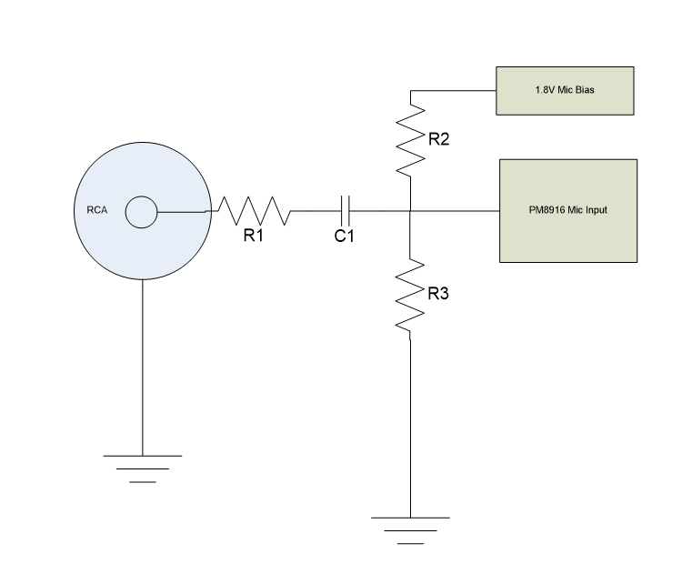

---
# Front Matter
# Title of your project used for the breadcrumb title and meta title.
title:  Audio Visualizer using DragonBoard410c
# Permalink your project will reside under on the 96boards.org website.
# separate your title's words with dashes for SEO purposes.
permalink: /projects/audio-visualizer-using-dragonboard410c/
#author: 96Boards

# Add a description of your project
description: This project aims to demonstrate the various possibilities of using the audio analog header on the DragonBoard410c. In this particular project I'll be focusing on the mic input and how that can be used to input audio with Line-In from another audio source like a HiFi system. That line-in signal then gets used to drive the NeoPixels connected to an Arduino.

# Add the names of your images which are stored in the sub folders here.
# The first image is always used in the table at /projects/
# This section is used to add a social media share image to your project.
# Place the image you'd like to use when sharing on social media in the /assets/images/projects/
# folder and adjust the following YAML accordingly.
# High Res 1920 x 1080
# regenerated on site build
#image: 
#    path: /assets/images/projects/share_image.png
#    list:
#        - thumb.png
#        - share.png
#social:
#  name: 96Boards
#  links:
#    - https://twitter.com/96boards
#    - https://www.facebook.com/96Boards/
#    - https://www.linkedin.com/company/96boards/
#    - https://plus.google.com/+96Boards
#    - https://github.com/96boards
project:
    # Difficulty level for your project <Beginner, Intermediate, Experienced>
    difficulty_level:
     - Experienced
    # Boards that you have used in this project. For a full list of boards see 
    # this file in the 96boards/website repo - _data/boards.yml
    boards_used: 
        - dragonboard410c
    # Verticals are catagories that your project belongs to. For a full list of verticals see 
    # this file in the 96boards/website repo - _data/verticles.yml
    verticals:
        - Maker
#Optional tags for your projects: meta-key words
tags:
- dragonboard410c
---
# Audio Visualizer using DragonBoard410c

## About
This project aims to demonstrate the various possibilities of using the audio analog header on the DragonBoard410c.
In this particular project I'll be focusing on the mic input and how that can be used to input audio with Line-In from another audio source like a HiFi system.
That line-in signal then gets used to drive the NeoPixels connected to an Arduino.

## Table of Contents

- [1) Hardware](#1-hardware)
  - [1.1) Hardware requirements](#11-hardware-requirements)
  - [1.2) Hardware setup](#12-hardware-setup)
- [2) Software](#2-software)
  - [2.1) DragonBoard410c Setup](#21-dragonboard410c-setup)
  - [2.1) Arduino Setup](#21-arduino-setup)
- [3) Setup and Run the Visualizer](#3-setup-and-run)

## 1) Hardware

### 1.1) Hardware requirements
- [96Boards Dragonboard 410c](https://www.96boards.org/product/dragonboard410c/)
- 5v 2A USB Power Bank
- [2x 22uF Bipolar Capacitors](https://in.rsdelivers.com/product/panasonic/ecea1hn220u/panasonic-bipolar-electrolytic-capacitor-22%CE%BCf-50v/7270489)
- 4x 2.7KOhm Resistors
- 2x 22KOhm Resistors
- [1x Arduino Nano](https://store.arduino.cc/usa/arduino-nano)
- [1x Logic Level Shifter](https://www.amazon.com/Logic-Converter-Bi-Directional-Module-Arduino/dp/B014MC1OAG/ref=sr_1_7?ie=UTF8&qid=1518261841&sr=8-7&keywords=logic+level+converter)
- [12x NeoPixels in strip or stick](https://www.adafruit.com/category/168)
- [1x Stereo Audio Socket of choice]
- Miscellaneous: Quantity as per required:
 - Connecting wires
 - Soldering Kit
 - Screwdriver Set
 - Double sided tape

### 1.2) Hardware Setup
- Arduino Setup

| Arduino Nano | Level Shifter HV | <-> | Level Shifter LV | DB410c  LS    | NeoPixels |
|:------------:|:----------------:|:---:|:----------------:|:-------------:|:---------:|
| A5 (SCL)     | HV1              | <-> | LV1              | 15 (I2C0_SCL) |           |
| A4 (SDA)     | HV2              | <-> | LV2              | 17 (I2C0_SDA) |           |
| 5V           | HV               | <-> | LV               | 35 (1v8)      | 5v        |
| GND          | GND              | <-> | GND              | GND           | GND       |
| D6           | NA               |     |                  |               | DI        |


- DragonBoard410c Audio Input Setup

  - Since the analog header is designed for Mic input level, we need to tone down the line input. To do that we'll be using a simple circuit:

    

    Values for the Components are as follow:
      - R1: 22KOhm
      - R2 & R3: 2.7KOhm
      - C1: 22uF (Bipolar)

  - For the stereo input we are using the following pins:
    - CDC_MIC2_P: Pin 6
    - CDC_MIC1_P: Bottom Right pin on the GM1 (Underside of the Low-speed Connector)


## 2) Software

### 2.1) DragonBoard410c Setup

- [Latest Linaro Debian Release Build](https://releases.linaro.org/96boards/dragonboard410c/linaro/debian/latest/)
- Python SMBus Module
  ```
  $ sudo apt install python-smbus
  ```

### 2.2) Arduino setup
- Flash ```src/neopixel.ino``` using the Arduino IDE.


## 3) Setup and Run the Visualizer

  1. Setup Alsa for stereo input:
  ```
  $ sudo ./src/setup_alsa.sh
  ```
  2. Run the Python code
  ```
  $ sudo arecord -D plughw:0,2 -r 48000 -f S16_LE -c 2 | python src/visual.py
  ```

#### References:
- [Piglow Visualizer](https://gist.github.com/daniel-j/f1406e301ab2c38ba53c)
- [Mic to Line Level circuit](https://discuss.96boards.org/t/stereo-mic-audio-input/4729/)
